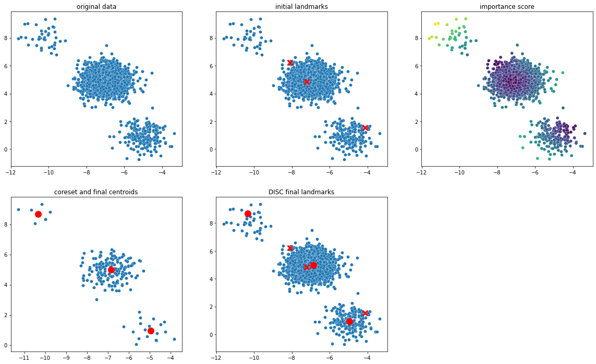
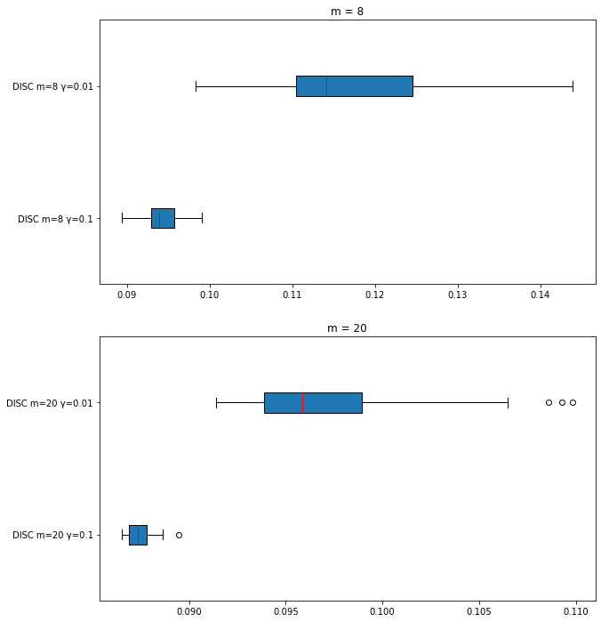
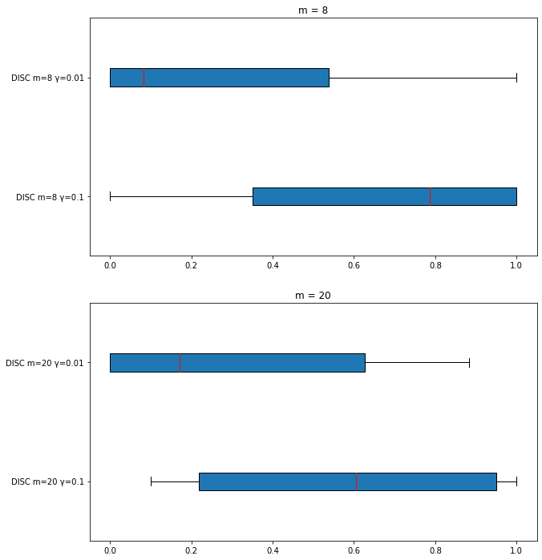
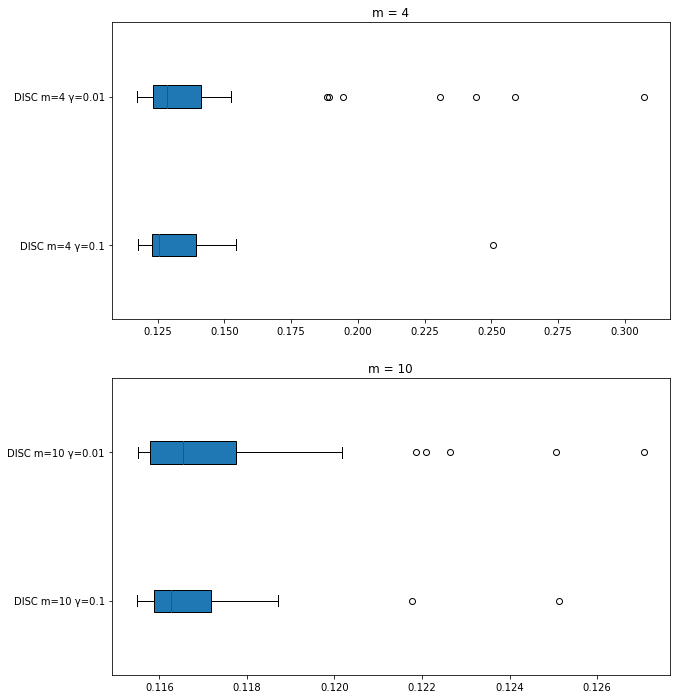
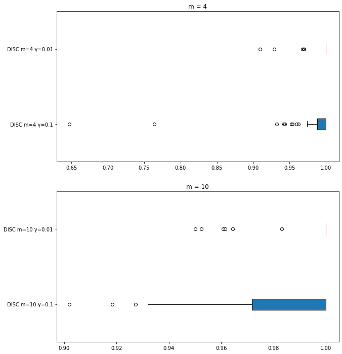
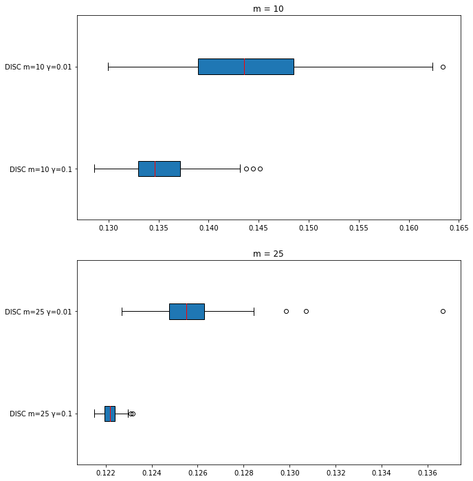
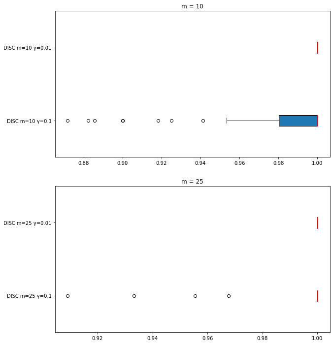

implementation of paper [*Kernel Matrix Approximation on Class-Imbalanced Data With an Application to Scientific Simulation*](https://ieeexplore.ieee.org/stamp/stamp.jsp?arnumber=9449889) authored by *PARISA HAJIBABAEE*, *FARHAD POURKAMALI-ANARAKI* and *MOHAMMAD AMIN HARIRI-ARDEBILI*

# Toy Dataset

```python
dataset = make_blobs(n_samples=[int(2000*0.02), int(2000*0.88), int(2000*0.1)], n_features=2, cluster_std=0.6,
                     centers=[[-10, 8], [-7, 5], [-5, 1]], random_state=2)

disc = DISCLandmarkSelection(num_landmarks=6, mixing_coef=0.5, compression_ratio=0.1, random_state=1)
disc.fit(dataset[0], dataset[1])
disc.plot()
```


# Real World Datasets
## Ozone
### Reconstruction Error

### Recall Score


## Mammography
### Reconstruction Error


### Recall Score


## Wine
### Reconstruction Error


### Recall Score
